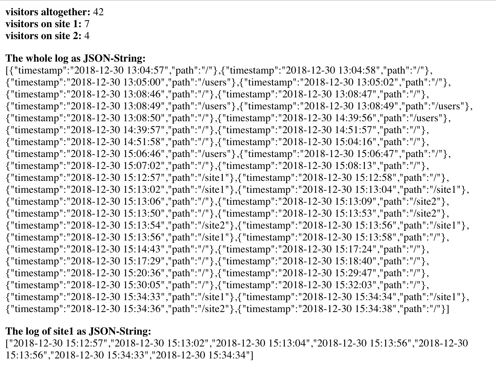

# express-visit-counter

### An express middleware that counts the visits of your website.

*app.js:*

```js
var visitCounter = require('express-visit-counter');

app.use(visitCounter.initialize());
```

## Installation

This is a [Node.js](https://nodejs.org/en/) module available through the
[npm registry](https://www.npmjs.com/).

Before installing, [download and install Node.js](https://nodejs.org/en/download/).
Node.js.

Installation is done using the
[`npm install` command](https://docs.npmjs.com/getting-started/installing-npm-packages-locally):

```bash
$ npm install express-visit-counter
```

## Example

*index.js for example:*

```js
var visitCounter = require('express-visit-counter').Loader;

router.get('/', async function (req, res, next) {
  let visitorsAltogether = await visitCounter.getCount();
  let visitorsSite1 = await visitCounter.getCount("/site1");
  let visitorsSite2 = await visitCounter.getCount("/site2");

  let visitorsLogAltogether = await visitCounter.getLog();
  let visitorsLogSite1 = await visitCounter.getLog("/site1");

  res.send(`
    <b>visitors altogether:</b> ${visitorsAltogether}<br />
    <b>visitors on site 1:</b> ${visitorsSite1}<br />
    <b>visitors on site 2:</b> ${visitorsSite2}<br />

    <p>
    <b>The whole log as JSON-String:</b><br />
    ${JSON.stringify(visitorsLogAltogether)}
    </p>

    <p>
    <b>The log of site1 as JSON-String:</b><br />
    ${JSON.stringify(visitorsLogSite1)}
    </p>
  `);
});
```



## Options

```js
app.use(visitCounter.initialize({
  sqlitePath: '<path you want to store the sqlite-file>'
}));
```

## Advice

If your code contains `app.use(express.static(...));`, it often makes sence to write `app.use(visitCounter.initialize());` **after** these lines so that static js files or css files are not logged.